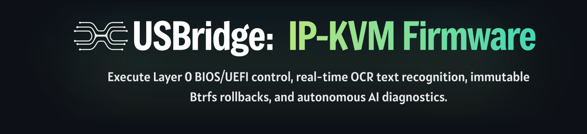
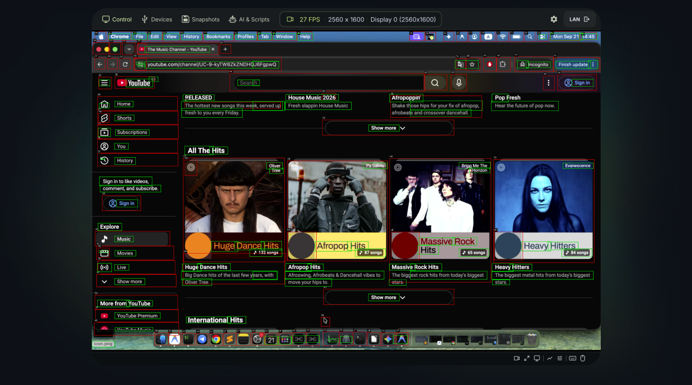
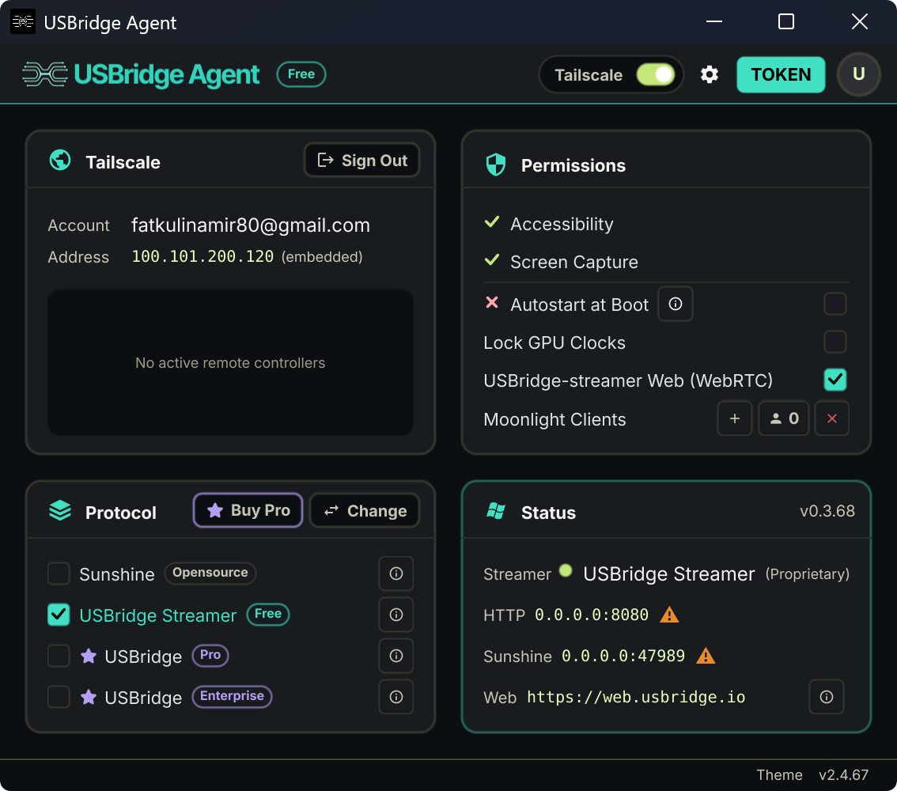

# USBridge: Ultra-Low Latency IP-KVM Firmware & KVM 2.0
<div align="center">


[](https://www.usbridge.io/hardware-agent)
[](./docs/README.md)
</div>

**The USBridge Ecosystem** is a professional-grade solution for system debugging and infrastructure management at the fundamental hardware level (Layer 0). It provides administrators with absolute control over hardware, bypassing the operating system while ensuring strict hardware isolation. 

The solution is available in two deployment formats:

| Deployment Format | Description | Quick Links |
| :--- | :--- | :--- |
| **1. USBridge Firmware** | Converts supported single-board computers (SBCs) into enterprise-grade IP-KVM appliances. | [Download for Radxa Zero 3W / 3E ➔](https://www.usbridge.io/hardware-agent)<br>[Download for Radxa Cubie A7Z ➔](https://www.usbridge.io/hardware-agent)<br>*Raspberry Pi, Banana Pi — In Development* |
| **2. USBridge KVM 2.0** | A turnkey, plug-and-play hardware appliance requiring no manual assembly. | [Buy USBridge KVM 2.0 ➔](https://www.usbridge.io/hardware-agent#buy-usbridge-kvm-2-0) |

---

## Key Features


| | |
| :--- | :--- |
| **Client Ecosystem**<br>Seamlessly integrate into the USBridge Client ecosystem as a unified point of control. Manage hardware KVMs, software agents, and remote desktops over an encrypted, peer-to-peer Tailscale mesh with zero port forwarding. | **BIOS-in-Terminal OCR Engine**<br>Real-time local OCR converts raw video into an interactive terminal stream directly on the device, bypassing cloud dependencies. Copy boot logs, search POST error codes, and administer machines over lightweight SSH. |


| | |
| :--- | :--- |
| **Immutable Snapshots**<br>Built on a hardware-isolated Btrfs architecture. Deltas are recorded and instantly frozen as read-only states, providing unbreakable rollbacks against ransomware, corrupted updates, and failed boots. | **Virtual Storage ISO Media**<br>Hardware mass storage emulation enables remote mounting of ISO, IMG, VDI, or VMDK images in read-only or read-write modes. Install operating systems and execute bootable rescue utilities out-of-band utilizing high-speed RAM caching. |



| | |
| :--- | :--- |
| **Automation MCP Protocol**<br>Integrate AI models via the Model Context Protocol (MCP) to automate BIOS configuration and execute hardware diagnostics. Utilize Starlark scripts to evaluate verifiable OCR text streams instead of fragile pixel matching. | **Turnkey KVM**<br>Deploy a ready-to-run hardware appliance engineered for instant integration. The pre-assembled USBridge KVM 2.0 features an OLED status display, active cooling, dual-band Wi-Fi, and pre-flashed firmware out of the box. |

## DIY KVM Setup: Full BIOS Control in 3 Minutes

Provision a supported SBC, flash the firmware image, and connect a standard USB capture interface to deploy your own IP-KVM.

### 1. Hardware Checklist (Bill of Materials)

| Component | Description |
| :--- | :--- |
| **Supported SBC** | Radxa Zero 3W / 3E, Radxa Cubie A7Z. |
| **HDMI-to-USB Capture Card** | Generic MS2109 (7–12$), or standard UVC dongle. |
| **MicroSD Card (2GB+)** | Standard 2GB+ capacity. Class 10 or higher recommended for fast boot times. |
| **Optional: OLED Status Screen** | On-device IP dashboard. Fully optional—the system runs perfectly headless via a single config file. |

### 2. 3-Minute Flashing Guide (Video Tutorial)

Watch the complete guide on how to flash the firmware and perform the first boot.

[](https://youtu.be/9FyPjEfH5Wg)

**Quick Links for Setup:**
* [Step-by-step Flashing Guide](./docs/content/9-updates-changelog/recovery-flashing-guide.md)
* [Headless Provisioning Guide](./docs/content/1-getting-started/headless-provisioning.md)
* [Full Documentation](./docs/README.md)

---

## Ultra-Low Latency Streaming: Powered by Moonlight

Forget about "jelly" cursors, video stutters, and input desync. USBridge-KVM 2.0 is the first hardware KVM-over-IP featuring native, on-board integration of the **Moonlight protocol**.

The hardware video capture and transmission pipeline is optimized to reduce latency to an imperceptible level. You get the absolute responsiveness of a direct connection: crystal-smooth mouse movement and instantaneous text input response. The latency is so low that the bandwidth and reaction speed are enough even for comfortable gameplay in dynamic platformers — let alone flawless server administration.


## BIOS-in-Terminal & AI Vision: Offline OCR & Hardware-Level Automation

The USBridge-KVM 2.0 goes beyond standard video streaming by analyzing the signal at the hardware level. The integrated compute module performs real-time, local Optical Character Recognition (OCR) and AI Vision, converting BIOS, Pre-OS, and graphical environments into an interactive data stream.

*   **AI Vision & Local Models:** A built-in MCP Proxy enables the activation of local AI models for autonomous visual analysis of graphical user interfaces. The system automatically recognizes interactive elements, text blocks, and on-screen buttons (highlighting them with bounding boxes), ensuring precise navigation without manual pixel hunting.
*   **AI Agent Integration (MCP Protocol):** Connect external or local AI agents via a local endpoint (e.g., `http://127.0.0.1:8765/api/mcp`). The neural network independently analyzes the screen structure, navigates through tabs, conducts system audits, and detects hardware failures based on visual data.
*   **Interactive Text-Based BIOS via SSH:** Configure the BIOS directly through a standard SSH session. The interface is rendered as plain text, allowing for immediate copying of error codes, BIOS versions, and serial numbers straight from the console.
*   **In-Client Scripting (Starlark):** Create and execute Starlark (Python syntax) scripts directly from the client interface. Automation relies on recognized text and objects: scripts can reliably wait for a specific target string (e.g., `"Aptio Setup Utility"`) to appear and then send the exact scan-code for navigation.



## Drive Emulation & Immutable Snapshots

### Virtual Media: Replacing Bootable Flash Drives
Universal hardware emulation allows you to mount virtual images directly from your workstation — whether it is a standard installation disc (ISO) or an entire, fully configured OS environment (VDI, VMDK). The target server sees it instantly as a standard, physically connected hard drive. The high-speed LPDDR4X cache fully compensates for network latency, while the Read-Write Overlay mode redirects all new writes to a separate layer, keeping your source Golden Image completely untouched.

### Hardware Ransomware Protection & Snapshots
During any modification, the system never overwrites the source files; instead, it saves only the "delta" of changes, instantly freezing the new copy in a read-only state. Thanks to strict hardware isolation, even if ransomware or an attacker gains full root privileges on the compromised server, they have no physical path to reach the KVM storage. All data is stored using the standard Btrfs file system.

---

## Solution Comparison

| Feature | USBridge 2.0 (Our Solution) | Embedded BMC (iDRAC / iLO) | Traditional IP-KVM |
| :--- | :--- | :--- | :--- |
| **Hardware Independence** | **Yes (Any hardware)** | No (Vendor lock-in) | Yes |
| **Screen OCR & SSH Terminal** | **Yes (On-device offline OCR)** | No | No |
| **AI Agents & Starlark Scripts**| **Yes (Built-in engine)** | No | No |
| **Immutable Snapshots** | **Yes (Btrfs, isolated)** | No | No |
| **Video Latency** | **Ultra-Low (Moonlight)** | High (Web GUI) | Medium (WebRTC / MJPEG) |
| **Power Management** | **Yes (Module included)** | Yes | No (Requires external PDU) |
| **Virtual Media** | **Yes (Out-of-the-box + Cache)** | Yes (Often requires license) | Model dependent |


---

## Client Download Matrix


The Client is the control interface installed on your workstation, laptop, or mobile device. It manages active hardware connections, live remote desktop streaming, virtual device passthrough, and your snapshot registry.

| Architecture | Windows | macOS | Linux | Android | iOS | Web Browser |
| :--- | :--- | :--- | :--- | :--- | :--- | :--- |
| **x86_64** | [Download](https://github.com/USBridge-Technologies/USBridge-Remote/releases/latest/download/USBridgeClient-Windows-x86_64.zip) | — | [Download](https://github.com/USBridge-Technologies/USBridge-Remote/releases/latest/download/USBridgeClient-Linux-x86_64.AppImage) | — | — | [Open App](https://web.usbridge.io) |
| **ARM64** | — | [Download](https://github.com/USBridge-Technologies/USBridge-Remote/releases/latest/download/USBridgeClient-macOS-arm64.dmg) | — | [Google Play](https://play.google.com/store/apps/details?id=io.usbridge.client) | [App Store](https://apps.apple.com/us/app/usbridge-client/id6787665935) | [Open App](https://web.usbridge.io) |

---

## Unified Ecosystem: [USBridge-Remote](https://github.com/USBridge-Technologies/USBridge-Remote)

Control your entire infrastructure from a single point using **[USBridge-Remote](https://github.com/USBridge-Technologies/USBridge-Remote)** — our dedicated cross-platform agent application. It enables a hybrid access approach within a single interface, combining hardware and software-level management:

* **Hardware Level (Layer 0):** Add USBridge-KVM devices for direct BIOS access, media mounting, and bare-metal recovery of "dead" machines.
* **Software Level (OS-level):** Deploy this lightweight software agent inside an already booted operating system for instant desktop management without KVM hardware dependency.

### Agent Download Matrix

The agent runs as a background service on your target OS (servers, remote workstations, or headless nodes) to stream the desktop and execute system-level commands.

<table>
  <tr>
    <!-- Left Column: Downloads Table -->
    <td valign="middle">
      <table>
        <tr>
          <th>Architecture</th>
          <th>Windows</th>
          <th>macOS</th>
          <th>Linux</th>
        </tr>
        <tr>
          <td><b>x86_64</b></td>
          <td><a href="https://github.com/USBridge-Technologies/USBridge-Remote/releases/latest/download/USBridgeAgent-Windows-x86_64.zip">Download</a></td>
          <td>—</td>
          <td><a href="https://github.com/USBridge-Technologies/USBridge-Remote/releases/latest/download/USBridgeAgent-Linux-x86_64.AppImage">Download</a></td>
        </tr>
        <tr>
          <td><b>ARM64</b></td>
          <td>—</td>
          <td><a href="https://github.com/USBridge-Technologies/USBridge-Remote/releases/latest/download/USBridgeAgent-macOS-arm64.dmg">Download</a></td>
          <td>—</td>
        </tr>
      </table>
    </td>
    <!-- Right Column: Image -->
    <td valign="middle" width="450">
      
    </td>
  </tr>
</table>

---

## Technical Specifications

### Hardware Architecture
*   **SoC:** Radxa Zero 3W (Rockchip RK3566, Quad-Core Cortex-A55).
*   **Cooling:** Custom CNC-milled aluminum heatsinks with an active cooling fan to prevent thermal throttling.
*   **Display:** Integrated IPS screen (240x240) for instant POST status monitoring via the built-in display mode.
*   **Power Management:** Dedicated **Power Management Module** board for hardware-level server power control.
*   **Enclosure:** Premium 3D-printed SLS Nylon PA12 case.

### Interfaces & Ports
*   **Video Capture:** Hardware-level UVC capture supporting 1080p@30fps / 720p@60fps via an external USB dongle, natively integrated with Moonlight.
*   **USB Type-C (2 ports):**
    *   *Port 1 (OTG):* Keyboard/mouse emulation, image mounting (Mass Storage), and power delivery input.
    *   *Port 2 (Host):* Dedicated port for connecting the external USB video capture dongle.
*   **Power Management Module:** 8-pin GPIO interface with external Power/Reset adapter board.
*   **Network:** Built-in Wi-Fi 6 module.
*   **Snapshots:** Dedicated MicroSD card slot.
*   **HDMI Passthrough:** Micro HDMI port for local video output at the server rack.

---

# Quick Start Guide

## 1. Hardware Connection & Cables


* **Port 1 (OTG):** Connect this port to the target server/PC. It delivers power to the KVM, emulates the mouse/keyboard, and handles virtual media mounting.
* **Port 2 (Host):** Connect the external video capture dongle here. Link the dongle to your server's video output using an HDMI cable.

> [!IMPORTANT]
> **Critical: Video Capture Dongle Modes**
> The USB Type-C capture dongle operates in two different modes depending on its orientation when plugged into the port. Please verify its status in the app:
> * **`[5G]` Mode (USB 3.0):** Standard high-performance mode. It provides maximum bandwidth (5 Gbps), rich image quality, and ultra-low input lag. **This is your target mode.**
> * **`[480M]` Mode (USB 2.0):** Slow compatibility mode (480 Mbps). The video stream may suffer from compression artifacts or noticeable latency.
> 
> **The Fix:** If you see the `[480M]` status, simply unplug the Type-C cable from the KVM, flip it 180°, and plug it back in to lock onto the `[5G]` mode.

---

## 2. Network & Application Setup

1. **Network Configuration:** The device comes with built-in Wi-Fi 6 and native Tailscale integration for instant remote access without messy router/firewall configurations. For initial Wi-Fi setup, use the integrated on-board IPS display or the local web panel.
2. **Firmware Update:** Once connected to the internet, navigate to the settings and update the device to the latest firmware version. Please allow a couple of minutes for the initial server synchronization.
3. **Launch:** Open the **USBridge-Client** application, add your new device using its IP address, and you are ready to go.
4. **Snapshot Setup (Data Protection):** Insert a MicroSD card into the KVM slot, open the device settings in the client app, and format the card. Once formatted, a backup drive will appear under the "Snapshots" tab, running a Btrfs-based Read-Write Overlay mode to protect your data.

## Headless Provisioning (Offline Setup)
If your USBridge-KVM 2.0 device is not connected to a display, or you want to automate the setup of multiple devices, you can configure it headlessly via an SD card (or a plain USB flash drive in one of the KVM's USB ports — both are scanned the same way):
1. Format a MicroSD card (or USB flash drive) to **FAT32** or **exFAT**.
2. Create a file named `usbridge_provision.json` in the root directory.
3. Use the following JSON syntax to configure network, static IPs, initial SSH users, and feature toggles:

```json
{
  "master_key": "my-secret-key-123",
  "interfaces": {
    "eth0": {
      "mode": "static",
      "ip": "192.168.1.100/24",
      "gateway": "192.168.1.1",
      "dns": "8.8.8.8"
    },
    "wlan0": {
      "mode": "dhcp",
      "ssid": "MyWiFi",
      "password": "My WiFi P@ssw0rd!"
    }
  },
  "users": [
    {
      "username": "admin",
      "password": "securepassword123"
    }
  ],
  "sshkvm_enabled": true,
  "mcp_enabled": true,
  "webrtc_enabled": true,
  "moonlight_enabled": true,
  "hdmi_passthrough": true
}
```
- The `ip` field's `/24` suffix is optional and sets the subnet mask (any prefix length works, e.g. `/16`) — omit it and the mask defaults to `/24`.
- The five toggles at the bottom are all optional — omit any of them to leave that setting as it currently is on the device. `sshkvm_enabled`, `mcp_enabled`, and `hdmi_passthrough` take effect immediately; `webrtc_enabled` and `moonlight_enabled` are picked up on the device's next start.
4. Insert the card/drive into the KVM and turn it on. The device will automatically detect and apply the configuration.
> **Security:** Upon successful application, the `master_key` field will be automatically erased, and the file will be renamed to `usbridge_provision.applied.json`. This prevents unauthorized access if the card is removed, and stops the device from applying the same config on every reboot. If you want to configure the device again, simply create a new `usbridge_provision.json` file. **If a display is attached, you'll be prompted to physically confirm the configuration on-screen before it's applied. The device senses whether a display is attached via the front-panel buttons' pull-up resistors — without a display attached, there's no way to confirm on-screen, so the configuration is applied on its own.**

### Connecting to BIOS-in-Terminal via SSH:
1. In the app interface, go to **Settings** -> **Authentication** -> **User Control** -> **Create User**.
2. Set up a username and password for authorization.
3. Open your favorite terminal emulator and run:
   ```bash
   ssh user@<kvm_ip_address> 
4. When prompted, enter the password you created in Step 2.

**Ready for Action!**
Once authorized, your terminal will instantly clear and start rendering the BIOS/Pre-OS video signal directly into your console as a live, interactive text stream. You can now select error codes, copy serial numbers, or pass automated Starlark scripts straight through the terminal session.

> [!WARNING]
> At this stage, the BIOS-in-Terminal feature exclusively supports text-based BIOS screens. Graphical UEFI interfaces are not yet recognized. You may notice minor character artifacts due to the OCR engine—the processing logic is being actively optimized, and accuracy will be perfected by the final release.

---

## 3. Power Management Module

To enable direct hardware-level power management (power on, power off, hard reset), use the included expansion board:


* **Input:** A pre-wired ribbon cable is already connected to the expansion module. Plug its other end into the **8-pin GPIO header** on the USBridge-KVM chassis.
* **Output (to the server's motherboard):** Connect the individual pins on the opposite side of the module to the **Front Panel** headers of your motherboard. Follow the white silk-screen labels on the PCB:

| Expansion Board Pin | Target Motherboard Header | Description |
| :--- | :--- | :--- |
| **`\|PWR\|`** | **Power Switch** (PWR_SW / PW_SW) | Powers the server on or off |
| **`\|RST\|`** | **Reset Switch** (RESET / RST) | Triggers a hard hardware reset |
| **`\|LED1\|`** | **Power LED** (P_LED) | Reports the server's power status to the client, even if there is no video signal |
| **`\|LED2\|`** | **HDD LED** (H_LED) | Displays storage drive activity inside the client UI |

---

## What's in the Box (Package Contents)


Every USBridge-KVM 2.0 kit comes with all the essential hardware and cables required for an out-of-the-box deployment:

1. **Premium SLS Case:** The main USBridge-KVM 2.0 unit enclosed in a durable, 3D-printed SLS Nylon PA12 housing with an integrated post-status IPS display.
2. **HDMI Video Capture Dongle:** High-performance external hardware-level UVC capture stick (supporting 1080p@30fps / 720p@60fps).
3. **USB Type-C to Type-C Cable:** High-speed data cable used to interconnect the host port of the KVM and the capture dongle.
4. **Power Management Module Board:** Dedicated adapter PCB for hardware-level server power control (Power/Reset/LEDs), complete with a pre-wired ribbon cable.
5. **Female-to-Female Dupont Jumper Wires:** Colorful 8-pin jumper wire set to easily bridge the Power Module board directly to your server's motherboard front panel headers.

> [!NOTE]
> **What else you might need:** To connect the setup to your server, you will only need a standard HDMI cable to link your server's GPU output directly to the included video capture dongle. Everything else is already in the box!

## Documentation

The [**full technical documentation**](./docs/README.md) covers setup, the KVM/video pipeline, [BIOS-in-Terminal](./docs/content/3-bios-in-terminal/technology-overview.md), Starlark/MCP AI-agent scripting, snapshot storage, hardware reference, and the [REST API](./docs/content/10-developer-api/rest-api-reference.md). A few of the pages people look for most:

* [Firmware Update Guide](./docs/content/9-updates-changelog/firmware-update-guide.md) — OTA updates, plus a full eMMC recovery reflash over USB (Linux/macOS/Windows, including WSL) if a device won't boot.
* [`flash-tool/`](./flash-tool/) — the recovery/first-flash script itself, ready to run.
* [Quick Start Guide](./docs/content/1-getting-started/quick-start.md) and [Headless & Bulk Provisioning](./docs/content/1-getting-started/headless-provisioning.md) for initial setup.

---
## Video Reviews & Media

| Channel | Review / Video | Link |
| :--- | :--- | :--- |
| [**Learn To HomeLab**](https://www.youtube.com/@learntohomelab) | Is This The Best KVM On The Market? | [Watch on YouTube](https://www.youtube.com/watch?v=U3GhuyD-gzw) |
| [**Barmine Tech**](https://www.youtube.com/@BarmineTech) | The Best KVM I've Used? USBridge KVM 2.0 (Independent Review) | [Watch on YouTube](https://www.youtube.com/watch?v=DA_hMD3T0Qg) |
| [**Jonatan Castro**](https://www.youtube.com/@JonatanCastro) | Unboxing & What's in the box (Spanish) | [Watch on YouTube](https://www.youtube.com/watch?v=7YJS81rI3U8&t) |
| [**USBridge**](https://www.youtube.com/@KVMUSBridge) | Official Overview & Feature Walkthrough | [Watch on YouTube](https://youtu.be/4h5Q8XpDzqI) |
| [**USBridge**](https://www.youtube.com/@KVMUSBridge) | Full Assembly & Packaging of USBridge KVM 2.0 | [Watch on YouTube](https://youtu.be/l6QtajSYtwQ) |


